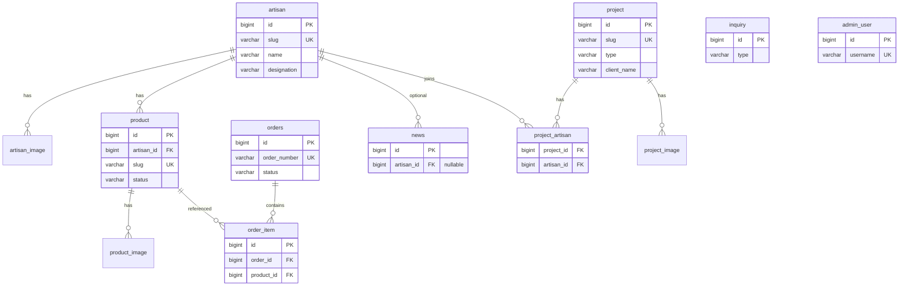

# ONDO DB 스키마

> MySQL 8 / utf8mb4 / InnoDB. dev는 H2(MySQL 모드) — DDL 호환 유지.
> ARCHITECTURE.md §3 도메인 모델과 1:1 대응. enum은 DB에선 VARCHAR로 저장(JPA `@Enumerated(STRING)`).

## ERD



## 공통 규칙

- PK: `BIGINT AUTO_INCREMENT`
- 모든 테이블에 `created_at DATETIME NOT NULL DEFAULT CURRENT_TIMESTAMP`, 변경 가능한 테이블은 `updated_at ... ON UPDATE CURRENT_TIMESTAMP` (JPA Auditing 사용)
- 소프트 삭제 없음 — 노출 제어는 `is_published` / `status`로. 삭제는 물리 삭제(주문 참조 상품은 스냅샷 보존으로 안전)
- FK는 `ON DELETE` 기본 RESTRICT, 이미지 테이블만 CASCADE
- 금액: `INT` (원 단위, 소수 없음)
- URL·경로: `VARCHAR(500)`

## 테이블 정의

### 1. artisan — 보유자

| 컬럼 | 타입 | 제약 | 설명 |
|---|---|---|---|
| id | BIGINT | PK, AI | |
| slug | VARCHAR(100) | UK, NOT NULL | URL용 (`yoon-jongguk`) |
| name | VARCHAR(50) | NOT NULL | 윤종국 |
| title | VARCHAR(50) | NOT NULL | 종목 (악기장) |
| designation | VARCHAR(20) | NOT NULL | `HOLDER`(보유자) / `SUCCESSOR`(이수자) / `MASTER`(명장) |
| short_intro | VARCHAR(200) | NOT NULL | 카드용 한 줄 ("4대 가업, 북메우기") |
| story | MEDIUMTEXT | | 랜딩 본문 (마크다운) |
| profile_image_url | VARCHAR(500) | | |
| cover_image_url | VARCHAR(500) | | |
| video_url | VARCHAR(500) | | 유튜브 embed |
| sns_links | JSON | | `{"instagram": "...", "youtube": "..."}` |
| display_order | INT | NOT NULL, DEFAULT 0 | 목록 정렬 |
| is_published | BOOLEAN | NOT NULL, DEFAULT FALSE | |
| created_at / updated_at | DATETIME | | |

인덱스: `uk_artisan_slug(slug)`, `idx_artisan_published(is_published, display_order)`

### 2. artisan_image — 보유자 갤러리

| 컬럼 | 타입 | 제약 |
|---|---|---|
| id | BIGINT | PK, AI |
| artisan_id | BIGINT | FK → artisan.id, ON DELETE CASCADE, NOT NULL |
| image_url | VARCHAR(500) | NOT NULL |
| caption | VARCHAR(200) | |
| sort_order | INT | NOT NULL, DEFAULT 0 |

인덱스: `idx_ai_artisan(artisan_id, sort_order)`

### 3. product — 상품

| 컬럼 | 타입 | 제약 | 설명 |
|---|---|---|---|
| id | BIGINT | PK, AI | |
| artisan_id | BIGINT | FK → artisan.id, NOT NULL | 상품은 반드시 보유자 소속 |
| slug | VARCHAR(100) | UK, NOT NULL | |
| name | VARCHAR(100) | NOT NULL | |
| category | VARCHAR(20) | NOT NULL | `ARTWORK` / `GIFT` / `GOODS` |
| price | INT | NOT NULL, DEFAULT 0 | INQUIRY_ONLY면 0 허용 |
| summary | VARCHAR(300) | | 목록 카드용 |
| description | MEDIUMTEXT | | 상세 본문 (마크다운) |
| thumbnail_url | VARCHAR(500) | | |
| stock_quantity | INT | NOT NULL, DEFAULT 0 | |
| status | VARCHAR(20) | NOT NULL | `ON_SALE` / `SOLD_OUT` / `INQUIRY_ONLY` / `HIDDEN` |
| external_url | VARCHAR(500) | | 텀블벅·스마트스토어 병행 판매처 |
| created_at / updated_at | DATETIME | | |

인덱스: `uk_product_slug(slug)`, `idx_product_artisan(artisan_id, status)`, `idx_product_list(status, category, created_at)`

CHECK: `price >= 0`, `stock_quantity >= 0`

### 4. product_image

artisan_image와 동일 구조 (`product_id` FK, CASCADE, `idx_pi_product(product_id, sort_order)`).

### 5. orders — 주문 (`order`는 예약어라 복수형)

| 컬럼 | 타입 | 제약 | 설명 |
|---|---|---|---|
| id | BIGINT | PK, AI | |
| order_number | VARCHAR(30) | UK, NOT NULL | `ONDO-20260712-XXXXXX` (날짜+랜덤) |
| orderer_name | VARCHAR(50) | NOT NULL | |
| phone | VARCHAR(20) | NOT NULL | 비회원 주문 조회 키 |
| email | VARCHAR(100) | | |
| zipcode | VARCHAR(10) | NOT NULL | |
| address | VARCHAR(300) | NOT NULL | |
| address_detail | VARCHAR(200) | | |
| memo | VARCHAR(300) | | 배송 요청사항 |
| total_amount | INT | NOT NULL | 스냅샷 합계 |
| status | VARCHAR(20) | NOT NULL, DEFAULT 'PENDING' | `PENDING` / `PAID` / `PREPARING` / `SHIPPED` / `DELIVERED` / `CANCELLED` |
| paid_at | DATETIME | | admin 수동 확인 시각 (PG 연동 전) |
| created_at / updated_at | DATETIME | | |

인덱스: `uk_order_number(order_number)`, `idx_order_lookup(order_number, phone)`, `idx_order_status(status, created_at)`

회원 없음 → user FK 없음. Phase 4에서 `user_id BIGINT NULL` 추가 예정.

### 6. order_item — 주문 상품 (스냅샷)

| 컬럼 | 타입 | 제약 | 설명 |
|---|---|---|---|
| id | BIGINT | PK, AI | |
| order_id | BIGINT | FK → orders.id, CASCADE, NOT NULL | |
| product_id | BIGINT | FK → product.id, **ON DELETE SET NULL**, NULL 허용 | 상품 삭제돼도 주문 기록 보존 |
| product_name | VARCHAR(100) | NOT NULL | 스냅샷 |
| artisan_name | VARCHAR(50) | NOT NULL | 스냅샷 (보유자별 정산 근거) |
| price | INT | NOT NULL | 주문 시점 가격 스냅샷 |
| quantity | INT | NOT NULL | CHECK `quantity > 0` |

인덱스: `idx_oi_order(order_id)`, `idx_oi_product(product_id)`

`artisan_name` 스냅샷 이유: BM이 "판매 수익 보유자 배분"이므로 주문 데이터가 곧 정산 근거. 상품·보유자 정보가 바뀌어도 정산 이력 불변.

### 7. news — 뉴스

| 컬럼 | 타입 | 제약 | 설명 |
|---|---|---|---|
| id | BIGINT | PK, AI | |
| title | VARCHAR(200) | NOT NULL | |
| thumbnail_url | VARCHAR(500) | | |
| type | VARCHAR(20) | NOT NULL | `ORIGINAL`(자체 작성) / `CURATED`(외부 링크) |
| content | MEDIUMTEXT | | ORIGINAL일 때 (마크다운) |
| external_url | VARCHAR(500) | | CURATED일 때 |
| source_name | VARCHAR(100) | | CURATED 출처 (연합뉴스 등) |
| category | VARCHAR(20) | NOT NULL | `ONDO_NEWS` / `TRADITION` / `ARTISAN` |
| artisan_id | BIGINT | FK → artisan.id, SET NULL, NULL 허용 | 보유자 소식일 때 연결 → 보유자 랜딩에 노출 |
| is_published | BOOLEAN | NOT NULL, DEFAULT FALSE | |
| published_at | DATETIME | | |
| created_at / updated_at | DATETIME | | |

인덱스: `idx_news_list(is_published, category, published_at DESC)`, `idx_news_artisan(artisan_id)`

애플리케이션 검증(DB 아님): ORIGINAL → content 필수, CURATED → external_url 필수.

### 8. project — 업무 이력·협업 실적 (쇼케이스)

| 컬럼 | 타입 | 제약 | 설명 |
|---|---|---|---|
| id | BIGINT | PK, AI | |
| slug | VARCHAR(100) | UK, NOT NULL | |
| title | VARCHAR(200) | NOT NULL | "OO기업 명절 선물 패키지 500세트" |
| type | VARCHAR(20) | NOT NULL | `B2B_GIFT` / `COLLAB` / `EXPERIENCE` / `LECTURE` / `B2G` / `EXHIBITION` / `FUNDING` / `ETC` |
| client_name | VARCHAR(100) | | 협업사명 (비공개 시 "국내 대기업 A사") |
| summary | VARCHAR(300) | | 카드용 한 줄 |
| description | MEDIUMTEXT | | 상세 본문 (마크다운: 배경→진행→결과) |
| result_metric | VARCHAR(200) | | 성과 한 줄 ("펀딩률 9,800%", "완판") — 카드·상세에 강조 표시 |
| thumbnail_url | VARCHAR(500) | | |
| project_date | DATE | NOT NULL | 대표 일자 (타임라인 정렬 기준) |
| is_featured | BOOLEAN | NOT NULL, DEFAULT FALSE | 홈·협업문의 페이지 노출 |
| display_order | INT | NOT NULL, DEFAULT 0 | |
| is_published | BOOLEAN | NOT NULL, DEFAULT FALSE | |
| created_at / updated_at | DATETIME | | |

인덱스: `uk_project_slug(slug)`, `idx_project_list(is_published, type, project_date DESC)`, `idx_project_featured(is_featured, display_order)`

### 9. project_artisan — 프로젝트 참여 보유자 (N:M)

| 컬럼 | 타입 | 제약 |
|---|---|---|
| project_id | BIGINT | FK → project.id, CASCADE, NOT NULL |
| artisan_id | BIGINT | FK → artisan.id, CASCADE, NOT NULL |
| role | VARCHAR(100) | 참여 역할 ("전통 북 제작") — 선택 |

PK: `(project_id, artisan_id)` 복합키. 인덱스: `idx_pa_artisan(artisan_id)` — 보유자 랜딩의 "참여 프로젝트" 조회용.

한 프로젝트에 보유자 여러 명 참여 가능(B2B 패키지 등), 보유자 없는 프로젝트도 가능(ONDO 자체 프로젝트 → 행 없음).

### 10. project_image

artisan_image와 동일 구조 (`project_id` FK, CASCADE, `idx_pji_project(project_id, sort_order)`).

### 11. inquiry — 협업문의

| 컬럼 | 타입 | 제약 | 설명 |
|---|---|---|---|
| id | BIGINT | PK, AI | |
| type | VARCHAR(20) | NOT NULL | `B2B_GIFT` / `COLLAB` / `EXPERIENCE` / `B2G` / `ETC` |
| company_name | VARCHAR(100) | | 개인 문의면 NULL |
| contact_name | VARCHAR(50) | NOT NULL | |
| email | VARCHAR(100) | NOT NULL | |
| phone | VARCHAR(20) | | |
| message | TEXT | NOT NULL | |
| status | VARCHAR(20) | NOT NULL, DEFAULT 'NEW' | `NEW` / `IN_REVIEW` / `REPLIED` / `CLOSED` |
| admin_note | VARCHAR(500) | | 내부 메모 |
| created_at / updated_at | DATETIME | | |

인덱스: `idx_inquiry_status(status, created_at DESC)`, `idx_inquiry_type(type)`

### 12. admin_user

| 컬럼 | 타입 | 제약 |
|---|---|---|
| id | BIGINT | PK, AI |
| username | VARCHAR(50) | UK, NOT NULL |
| password | VARCHAR(100) | NOT NULL (BCrypt) |
| name | VARCHAR(50) | NOT NULL |
| role | VARCHAR(20) | NOT NULL, DEFAULT 'ADMIN' |
| last_login_at | DATETIME | |
| created_at | DATETIME | |

Refresh 토큰은 DB 저장 없이 JWT 만료 짧게(Access 30분/Refresh 14일, 쿠키) 운영 — 필요 시 `refresh_token` 테이블 추가.

## DDL

```sql
CREATE TABLE artisan (
    id                BIGINT AUTO_INCREMENT PRIMARY KEY,
    slug              VARCHAR(100) NOT NULL,
    name              VARCHAR(50)  NOT NULL,
    title             VARCHAR(50)  NOT NULL,
    designation       VARCHAR(20)  NOT NULL,
    short_intro       VARCHAR(200) NOT NULL,
    story             MEDIUMTEXT,
    profile_image_url VARCHAR(500),
    cover_image_url   VARCHAR(500),
    video_url         VARCHAR(500),
    sns_links         JSON,
    display_order     INT     NOT NULL DEFAULT 0,
    is_published      BOOLEAN NOT NULL DEFAULT FALSE,
    created_at DATETIME NOT NULL DEFAULT CURRENT_TIMESTAMP,
    updated_at DATETIME NOT NULL DEFAULT CURRENT_TIMESTAMP ON UPDATE CURRENT_TIMESTAMP,
    CONSTRAINT uk_artisan_slug UNIQUE (slug),
    INDEX idx_artisan_published (is_published, display_order)
) ENGINE=InnoDB DEFAULT CHARSET=utf8mb4;

CREATE TABLE artisan_image (
    id         BIGINT AUTO_INCREMENT PRIMARY KEY,
    artisan_id BIGINT       NOT NULL,
    image_url  VARCHAR(500) NOT NULL,
    caption    VARCHAR(200),
    sort_order INT NOT NULL DEFAULT 0,
    created_at DATETIME NOT NULL DEFAULT CURRENT_TIMESTAMP,
    CONSTRAINT fk_ai_artisan FOREIGN KEY (artisan_id) REFERENCES artisan (id) ON DELETE CASCADE,
    INDEX idx_ai_artisan (artisan_id, sort_order)
) ENGINE=InnoDB DEFAULT CHARSET=utf8mb4;

CREATE TABLE product (
    id             BIGINT AUTO_INCREMENT PRIMARY KEY,
    artisan_id     BIGINT       NOT NULL,
    slug           VARCHAR(100) NOT NULL,
    name           VARCHAR(100) NOT NULL,
    category       VARCHAR(20)  NOT NULL,
    price          INT          NOT NULL DEFAULT 0,
    summary        VARCHAR(300),
    description    MEDIUMTEXT,
    thumbnail_url  VARCHAR(500),
    stock_quantity INT         NOT NULL DEFAULT 0,
    status         VARCHAR(20) NOT NULL,
    external_url   VARCHAR(500),
    created_at DATETIME NOT NULL DEFAULT CURRENT_TIMESTAMP,
    updated_at DATETIME NOT NULL DEFAULT CURRENT_TIMESTAMP ON UPDATE CURRENT_TIMESTAMP,
    CONSTRAINT uk_product_slug UNIQUE (slug),
    CONSTRAINT fk_product_artisan FOREIGN KEY (artisan_id) REFERENCES artisan (id),
    CONSTRAINT chk_product_price CHECK (price >= 0),
    CONSTRAINT chk_product_stock CHECK (stock_quantity >= 0),
    INDEX idx_product_artisan (artisan_id, status),
    INDEX idx_product_list (status, category, created_at)
) ENGINE=InnoDB DEFAULT CHARSET=utf8mb4;

CREATE TABLE product_image (
    id         BIGINT AUTO_INCREMENT PRIMARY KEY,
    product_id BIGINT       NOT NULL,
    image_url  VARCHAR(500) NOT NULL,
    caption    VARCHAR(200),
    sort_order INT NOT NULL DEFAULT 0,
    created_at DATETIME NOT NULL DEFAULT CURRENT_TIMESTAMP,
    CONSTRAINT fk_pi_product FOREIGN KEY (product_id) REFERENCES product (id) ON DELETE CASCADE,
    INDEX idx_pi_product (product_id, sort_order)
) ENGINE=InnoDB DEFAULT CHARSET=utf8mb4;

CREATE TABLE orders (
    id             BIGINT AUTO_INCREMENT PRIMARY KEY,
    order_number   VARCHAR(30)  NOT NULL,
    orderer_name   VARCHAR(50)  NOT NULL,
    phone          VARCHAR(20)  NOT NULL,
    email          VARCHAR(100),
    zipcode        VARCHAR(10)  NOT NULL,
    address        VARCHAR(300) NOT NULL,
    address_detail VARCHAR(200),
    memo           VARCHAR(300),
    total_amount   INT         NOT NULL,
    status         VARCHAR(20) NOT NULL DEFAULT 'PENDING',
    paid_at        DATETIME,
    created_at DATETIME NOT NULL DEFAULT CURRENT_TIMESTAMP,
    updated_at DATETIME NOT NULL DEFAULT CURRENT_TIMESTAMP ON UPDATE CURRENT_TIMESTAMP,
    CONSTRAINT uk_order_number UNIQUE (order_number),
    INDEX idx_order_lookup (order_number, phone),
    INDEX idx_order_status (status, created_at)
) ENGINE=InnoDB DEFAULT CHARSET=utf8mb4;

CREATE TABLE order_item (
    id           BIGINT AUTO_INCREMENT PRIMARY KEY,
    order_id     BIGINT       NOT NULL,
    product_id   BIGINT,
    product_name VARCHAR(100) NOT NULL,
    artisan_name VARCHAR(50)  NOT NULL,
    price        INT NOT NULL,
    quantity     INT NOT NULL,
    CONSTRAINT fk_oi_order   FOREIGN KEY (order_id)   REFERENCES orders (id)  ON DELETE CASCADE,
    CONSTRAINT fk_oi_product FOREIGN KEY (product_id) REFERENCES product (id) ON DELETE SET NULL,
    CONSTRAINT chk_oi_quantity CHECK (quantity > 0),
    INDEX idx_oi_order (order_id),
    INDEX idx_oi_product (product_id)
) ENGINE=InnoDB DEFAULT CHARSET=utf8mb4;

CREATE TABLE news (
    id            BIGINT AUTO_INCREMENT PRIMARY KEY,
    title         VARCHAR(200) NOT NULL,
    thumbnail_url VARCHAR(500),
    type          VARCHAR(20) NOT NULL,
    content       MEDIUMTEXT,
    external_url  VARCHAR(500),
    source_name   VARCHAR(100),
    category      VARCHAR(20) NOT NULL,
    artisan_id    BIGINT,
    is_published  BOOLEAN NOT NULL DEFAULT FALSE,
    published_at  DATETIME,
    created_at DATETIME NOT NULL DEFAULT CURRENT_TIMESTAMP,
    updated_at DATETIME NOT NULL DEFAULT CURRENT_TIMESTAMP ON UPDATE CURRENT_TIMESTAMP,
    CONSTRAINT fk_news_artisan FOREIGN KEY (artisan_id) REFERENCES artisan (id) ON DELETE SET NULL,
    INDEX idx_news_list (is_published, category, published_at DESC),
    INDEX idx_news_artisan (artisan_id)
) ENGINE=InnoDB DEFAULT CHARSET=utf8mb4;

CREATE TABLE project (
    id            BIGINT AUTO_INCREMENT PRIMARY KEY,
    slug          VARCHAR(100) NOT NULL,
    title         VARCHAR(200) NOT NULL,
    type          VARCHAR(20)  NOT NULL,
    client_name   VARCHAR(100),
    summary       VARCHAR(300),
    description   MEDIUMTEXT,
    result_metric VARCHAR(200),
    thumbnail_url VARCHAR(500),
    project_date  DATE    NOT NULL,
    is_featured   BOOLEAN NOT NULL DEFAULT FALSE,
    display_order INT     NOT NULL DEFAULT 0,
    is_published  BOOLEAN NOT NULL DEFAULT FALSE,
    created_at DATETIME NOT NULL DEFAULT CURRENT_TIMESTAMP,
    updated_at DATETIME NOT NULL DEFAULT CURRENT_TIMESTAMP ON UPDATE CURRENT_TIMESTAMP,
    CONSTRAINT uk_project_slug UNIQUE (slug),
    INDEX idx_project_list (is_published, type, project_date DESC),
    INDEX idx_project_featured (is_featured, display_order)
) ENGINE=InnoDB DEFAULT CHARSET=utf8mb4;

CREATE TABLE project_artisan (
    project_id BIGINT NOT NULL,
    artisan_id BIGINT NOT NULL,
    role       VARCHAR(100),
    PRIMARY KEY (project_id, artisan_id),
    CONSTRAINT fk_pa_project FOREIGN KEY (project_id) REFERENCES project (id) ON DELETE CASCADE,
    CONSTRAINT fk_pa_artisan FOREIGN KEY (artisan_id) REFERENCES artisan (id) ON DELETE CASCADE,
    INDEX idx_pa_artisan (artisan_id)
) ENGINE=InnoDB DEFAULT CHARSET=utf8mb4;

CREATE TABLE project_image (
    id         BIGINT AUTO_INCREMENT PRIMARY KEY,
    project_id BIGINT       NOT NULL,
    image_url  VARCHAR(500) NOT NULL,
    caption    VARCHAR(200),
    sort_order INT NOT NULL DEFAULT 0,
    created_at DATETIME NOT NULL DEFAULT CURRENT_TIMESTAMP,
    CONSTRAINT fk_pji_project FOREIGN KEY (project_id) REFERENCES project (id) ON DELETE CASCADE,
    INDEX idx_pji_project (project_id, sort_order)
) ENGINE=InnoDB DEFAULT CHARSET=utf8mb4;

CREATE TABLE inquiry (
    id           BIGINT AUTO_INCREMENT PRIMARY KEY,
    type         VARCHAR(20)  NOT NULL,
    company_name VARCHAR(100),
    contact_name VARCHAR(50)  NOT NULL,
    email        VARCHAR(100) NOT NULL,
    phone        VARCHAR(20),
    message      TEXT         NOT NULL,
    status       VARCHAR(20)  NOT NULL DEFAULT 'NEW',
    admin_note   VARCHAR(500),
    created_at DATETIME NOT NULL DEFAULT CURRENT_TIMESTAMP,
    updated_at DATETIME NOT NULL DEFAULT CURRENT_TIMESTAMP ON UPDATE CURRENT_TIMESTAMP,
    INDEX idx_inquiry_status (status, created_at DESC),
    INDEX idx_inquiry_type (type)
) ENGINE=InnoDB DEFAULT CHARSET=utf8mb4;

CREATE TABLE admin_user (
    id            BIGINT AUTO_INCREMENT PRIMARY KEY,
    username      VARCHAR(50)  NOT NULL,
    password      VARCHAR(100) NOT NULL,
    name          VARCHAR(50)  NOT NULL,
    role          VARCHAR(20)  NOT NULL DEFAULT 'ADMIN',
    last_login_at DATETIME,
    created_at DATETIME NOT NULL DEFAULT CURRENT_TIMESTAMP,
    CONSTRAINT uk_admin_username UNIQUE (username)
) ENGINE=InnoDB DEFAULT CHARSET=utf8mb4;
```

## 향후 확장 (Phase 4, 테이블 예약)

| 테이블 | 용도 | 시점 |
|---|---|---|
| payment | PG 결제 이력 (orders와 1:N — 재시도 대응). `payment_key`, `method`, `amount`, `status`, `approved_at` | 토스페이먼츠 연동 시 |
| users | 일반 회원. orders에 `user_id` NULL 컬럼 추가 | 회원 기능 도입 시 |
| settlement | 보유자별 정산 집계 (order_item 스냅샷 기반) | 정산 자동화 시 |
| artisan_i18n / product_i18n | 다국어(영문) 컬럼 분리 | 해외 판로 시 |

지금 스키마는 위 4개를 붙일 때 **기존 테이블 변경이 없거나 NULL 컬럼 1개 추가**로 끝나도록 설계됨.

## 운영 노트

- 스키마 관리: dev는 JPA `ddl-auto: validate` + 이 문서의 DDL, 운영 전환 시 Flyway 도입 (`V1__init.sql`에 위 DDL)
- 시드: dev 프로필 `data.sql`에 악기장 윤종국 + 샘플 상품 + 샘플 실적(텀블벅 펀딩 등) + admin 계정
- 재고 차감: 주문 생성 시 `UPDATE ... SET stock_quantity = stock_quantity - ? WHERE stock_quantity >= ?` (조건부 UPDATE로 동시성 처리, 결제 보류 단계에선 이 정도로 충분)
