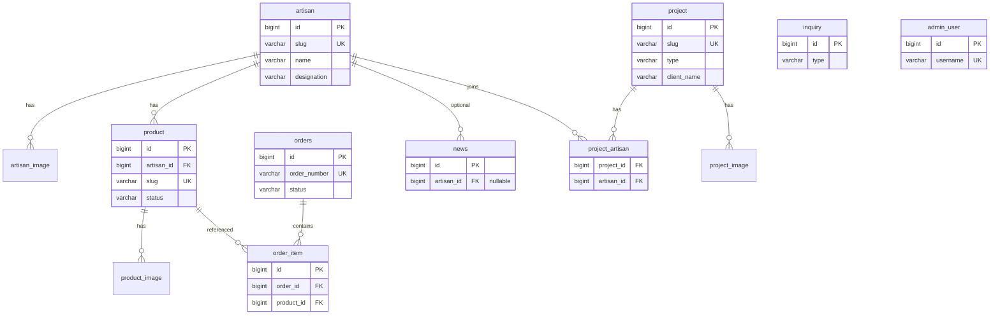

# ONDO DB 스키마

> MySQL 8.4 / utf8mb4 / InnoDB. dev는 H2(MySQL 모드) — DDL 호환 유지.
> ARCHITECTURE.md §3 도메인 모델과 1:1 대응.
> enum은 DB에선 VARCHAR(20)로 저장 — `@Enumerated(STRING)` + `@JdbcTypeCode(SqlTypes.VARCHAR)`.
> (어노테이션이 없으면 Hibernate 6이 MySQL 네이티브 `ENUM` 타입을 만들어, enum 상수 추가마다 `ALTER TABLE`이 필요해진다.)
>
> **스키마 정본은 `backend/src/main/resources/db/migration/V1__init_schema.sql`이다.**
> 아래 표는 설계 의도를 설명하는 문서이고, 스키마 변경은 새 마이그레이션(V2, V3…)으로만 한다.

## ERD


```mermaid
erDiagram
    artisan ||--o{ artisan_image : has
    artisan ||--o{ product : has
    product ||--o{ product_image : has
    product ||--o{ order_item : referenced
    orders  ||--o{ order_item : contains
    artisan ||--o{ news : "optional"
    project ||--o{ project_artisan : has
    artisan ||--o{ project_artisan : joins
    project ||--o{ project_image : has

    artisan {
        bigint id PK
        varchar slug UK
        varchar name
        varchar designation
    }
    product {
        bigint id PK
        bigint artisan_id FK
        varchar slug UK
        varchar status
    }
    orders {
        bigint id PK
        varchar order_number UK
        varchar status
    }
    order_item {
        bigint id PK
        bigint order_id FK
        bigint product_id FK
    }
    news {
        bigint id PK
        bigint artisan_id FK "nullable"
    }
    project {
        bigint id PK
        varchar slug UK
        varchar type
        varchar client_name
    }
    project_artisan {
        bigint project_id FK
        bigint artisan_id FK
    }
    inquiry {
        bigint id PK
        varchar type
    }
    admin_user {
        bigint id PK
        varchar username UK
    }
```

## 공통 규칙

- PK: `BIGINT AUTO_INCREMENT`
- 타임스탬프: `DATETIME(6)` (Hibernate 기본 정밀도). `created_at`/`updated_at`은 JPA Auditing이 채우며,
  DB 기본값(`DEFAULT CURRENT_TIMESTAMP(6)`, `ON UPDATE CURRENT_TIMESTAMP(6)`)은 수동 SQL 대비용 안전장치다.
  `order_item`만 타임스탬프가 없다 — 주문 시점이 곧 `orders.created_at`이라서.
- boolean: `BIT(1)` (Hibernate의 MySQL 기본 매핑)
- 소프트 삭제 없음 — 노출 제어는 `is_published` / `status`로. 삭제는 물리 삭제(주문 참조 상품은 스냅샷 보존으로 안전)
- FK는 `ON DELETE` 기본 RESTRICT, 이미지·조인 테이블은 CASCADE, 이력 보존이 필요한 곳은 SET NULL
- 금액: `INT` (원 단위, 소수 없음)
- URL·경로: `VARCHAR(500)`
- 마크다운 본문·JSON(`sns_links`): `TEXT`

## 테이블 정의

### 1. artisan — 보유자

| 컬럼 | 타입 | 제약 | 설명 |
|---|---|---|---|
| id | BIGINT | PK, AI | |
| slug | VARCHAR(100) | UK, NOT NULL | URL용 (`yoon-jongguk`) |
| name | VARCHAR(50) | NOT NULL | 윤종국 |
| title | VARCHAR(50) | NOT NULL | 종목 (악기장) |
| designation | VARCHAR(20) | NOT NULL | `HOLDER`(보유자) / `SUCCESSOR`(이수자) / `MASTER`(명장) |
| short_intro | VARCHAR(200) | NOT NULL | 카드용 한 줄 ("4대 가업, 북메우기") |
| story | TEXT | | 랜딩 본문 (마크다운) |
| profile_image_url | VARCHAR(500) | | |
| cover_image_url | VARCHAR(500) | | |
| video_url | VARCHAR(500) | | 유튜브 embed |
| sns_links | TEXT | | JSON 문자열 `{"instagram": "...", "youtube": "..."}` (SnsLinksConverter) |
| display_order | INT | NOT NULL, DEFAULT 0 | 목록 정렬 |
| is_published | BIT(1) | NOT NULL, DEFAULT 0 | |
| created_at / updated_at | DATETIME(6) | NOT NULL | |

인덱스: `uk_artisan_slug(slug)`, `idx_artisan_published(is_published, display_order)`

### 2. artisan_image — 보유자 갤러리

| 컬럼 | 타입 | 제약 |
|---|---|---|
| id | BIGINT | PK, AI |
| artisan_id | BIGINT | FK → artisan.id, ON DELETE CASCADE, NOT NULL |
| image_url | VARCHAR(500) | NOT NULL |
| caption | VARCHAR(200) | |
| sort_order | INT | NOT NULL, DEFAULT 0 |
| created_at / updated_at | DATETIME(6) | NOT NULL |

인덱스: `idx_ai_artisan(artisan_id, sort_order)`

### 3. product — 상품

| 컬럼 | 타입 | 제약 | 설명 |
|---|---|---|---|
| id | BIGINT | PK, AI | |
| artisan_id | BIGINT | FK → artisan.id, NOT NULL | 상품은 반드시 보유자 소속 |
| slug | VARCHAR(100) | UK, NOT NULL | |
| name | VARCHAR(100) | NOT NULL | |
| category | VARCHAR(20) | NOT NULL | `ARTWORK` / `GIFT` / `GOODS` |
| price | INT | NOT NULL, DEFAULT 0 | INQUIRY_ONLY면 0 허용 |
| summary | VARCHAR(300) | | 목록 카드용 |
| description | TEXT | | 상세 본문 (마크다운) |
| thumbnail_url | VARCHAR(500) | | |
| stock_quantity | INT | NOT NULL, DEFAULT 0 | |
| status | VARCHAR(20) | NOT NULL | `ON_SALE` / `SOLD_OUT` / `INQUIRY_ONLY` / `HIDDEN` |
| external_url | VARCHAR(500) | | 텀블벅·스마트스토어 병행 판매처 |
| created_at / updated_at | DATETIME(6) | NOT NULL | |

인덱스: `uk_product_slug(slug)`, `idx_product_artisan(artisan_id, status)`, `idx_product_list(status, category, created_at)`

CHECK: `price >= 0`, `stock_quantity >= 0`

### 4. product_image

artisan_image와 동일 구조 (`product_id` FK, CASCADE, `idx_pi_product(product_id, sort_order)`).

### 5. orders — 주문 (`order`는 예약어라 복수형)

| 컬럼 | 타입 | 제약 | 설명 |
|---|---|---|---|
| id | BIGINT | PK, AI | |
| order_number | VARCHAR(30) | UK, NOT NULL | `ONDO-20260712-XXXXXX` (날짜+랜덤) |
| orderer_name | VARCHAR(50) | NOT NULL | |
| phone | VARCHAR(20) | NOT NULL | 비회원 주문 조회 키 |
| email | VARCHAR(100) | | |
| zipcode | VARCHAR(10) | NOT NULL | |
| address | VARCHAR(300) | NOT NULL | |
| address_detail | VARCHAR(200) | | |
| memo | VARCHAR(300) | | 배송 요청사항 |
| total_amount | INT | NOT NULL | 스냅샷 합계 |
| status | VARCHAR(20) | NOT NULL, DEFAULT 'PENDING' | `PENDING` / `PAID` / `PREPARING` / `SHIPPED` / `DELIVERED` / `CANCELLED` |
| paid_at | DATETIME(6) | | admin 수동 확인 시각 (PG 연동 전) |
| created_at / updated_at | DATETIME(6) | NOT NULL | |

인덱스: `uk_order_number(order_number)`, `idx_order_lookup(order_number, phone)`, `idx_order_status(status, created_at)`

회원 없음 → user FK 없음. Phase 4에서 `user_id BIGINT NULL` 추가 예정.

### 6. order_item — 주문 상품 (스냅샷)

| 컬럼 | 타입 | 제약 | 설명 |
|---|---|---|---|
| id | BIGINT | PK, AI | |
| order_id | BIGINT | FK → orders.id, CASCADE, NOT NULL | |
| product_id | BIGINT | FK → product.id, **ON DELETE SET NULL**, NULL 허용 | 상품 삭제돼도 주문 기록 보존 |
| product_name | VARCHAR(100) | NOT NULL | 스냅샷 |
| artisan_name | VARCHAR(50) | NOT NULL | 스냅샷 (보유자별 정산 근거) |
| price | INT | NOT NULL | 주문 시점 가격 스냅샷 |
| quantity | INT | NOT NULL | CHECK `quantity > 0` |

인덱스: `idx_oi_order(order_id)`, `idx_oi_product(product_id)`

`artisan_name` 스냅샷 이유: BM이 "판매 수익 보유자 배분"이므로 주문 데이터가 곧 정산 근거. 상품·보유자 정보가 바뀌어도 정산 이력 불변.

### 7. news — 뉴스

| 컬럼 | 타입 | 제약 | 설명 |
|---|---|---|---|
| id | BIGINT | PK, AI | |
| title | VARCHAR(200) | NOT NULL | |
| thumbnail_url | VARCHAR(500) | | |
| type | VARCHAR(20) | NOT NULL | `ORIGINAL`(자체 작성) / `CURATED`(외부 링크) |
| content | TEXT | | ORIGINAL일 때 (마크다운) |
| external_url | VARCHAR(500) | | CURATED일 때 |
| source_name | VARCHAR(100) | | CURATED 출처 (연합뉴스 등) |
| category | VARCHAR(20) | NOT NULL | `ONDO_NEWS` / `TRADITION` / `ARTISAN` |
| artisan_id | BIGINT | FK → artisan.id, SET NULL, NULL 허용 | 보유자 소식일 때 연결 → 보유자 랜딩에 노출 |
| is_published | BIT(1) | NOT NULL, DEFAULT 0 | |
| published_at | DATETIME(6) | | |
| created_at / updated_at | DATETIME(6) | NOT NULL | |

인덱스: `idx_news_list(is_published, category, published_at)`, `idx_news_artisan(artisan_id)`

애플리케이션 검증(DB 아님): ORIGINAL → content 필수, CURATED → external_url 필수.

### 8. project — 업무 이력·협업 실적 (쇼케이스)

| 컬럼 | 타입 | 제약 | 설명 |
|---|---|---|---|
| id | BIGINT | PK, AI | |
| slug | VARCHAR(100) | UK, NOT NULL | |
| title | VARCHAR(200) | NOT NULL | "OO기업 명절 선물 패키지 500세트" |
| type | VARCHAR(20) | NOT NULL | `B2B_GIFT` / `COLLAB` / `EXPERIENCE` / `LECTURE` / `B2G` / `EXHIBITION` / `FUNDING` / `ETC` |
| client_name | VARCHAR(100) | | 협업사명 (비공개 시 "국내 대기업 A사") |
| summary | VARCHAR(300) | | 카드용 한 줄 |
| description | TEXT | | 상세 본문 (마크다운: 배경→진행→결과) |
| result_metric | VARCHAR(200) | | 성과 한 줄 ("펀딩률 9,800%", "완판") — 카드·상세에 강조 표시 |
| thumbnail_url | VARCHAR(500) | | |
| project_date | DATE | NOT NULL | 대표 일자 (타임라인 정렬 기준) |
| is_featured | BIT(1) | NOT NULL, DEFAULT 0 | 홈·협업문의 페이지 노출 |
| display_order | INT | NOT NULL, DEFAULT 0 | |
| is_published | BIT(1) | NOT NULL, DEFAULT 0 | |
| created_at / updated_at | DATETIME(6) | NOT NULL | |

인덱스: `uk_project_slug(slug)`, `idx_project_list(is_published, type, project_date)`, `idx_project_featured(is_featured, display_order)`

### 9. project_artisan — 프로젝트 참여 보유자 (N:M)

| 컬럼 | 타입 | 제약 |
|---|---|---|
| project_id | BIGINT | FK → project.id, CASCADE, NOT NULL |
| artisan_id | BIGINT | FK → artisan.id, CASCADE, NOT NULL |
| role | VARCHAR(100) | 참여 역할 ("전통 북 제작") — 선택 |

PK는 대리키 `id BIGINT AUTO_INCREMENT` (JPA 매핑 단순화), `(project_id, artisan_id)`는 유니크 제약 `uk_pa`.
인덱스: `idx_pa_artisan(artisan_id)` — 보유자 랜딩의 "참여 프로젝트" 조회용.

한 프로젝트에 보유자 여러 명 참여 가능(B2B 패키지 등), 보유자 없는 프로젝트도 가능(ONDO 자체 프로젝트 → 행 없음).

### 10. project_image

artisan_image와 동일 구조 (`project_id` FK, CASCADE, `idx_pji_project(project_id, sort_order)`).

### 11. inquiry — 협업문의

| 컬럼 | 타입 | 제약 | 설명 |
|---|---|---|---|
| id | BIGINT | PK, AI | |
| type | VARCHAR(20) | NOT NULL | `B2B_GIFT` / `COLLAB` / `EXPERIENCE` / `B2G` / `ETC` |
| company_name | VARCHAR(100) | | 개인 문의면 NULL |
| contact_name | VARCHAR(50) | NOT NULL | |
| email | VARCHAR(100) | NOT NULL | |
| phone | VARCHAR(20) | | |
| message | TEXT | NOT NULL | |
| status | VARCHAR(20) | NOT NULL, DEFAULT 'NEW' | `NEW` / `IN_REVIEW` / `REPLIED` / `CLOSED` |
| admin_note | VARCHAR(500) | | 내부 메모 |
| created_at / updated_at | DATETIME(6) | NOT NULL | |

인덱스: `idx_inquiry_status(status, created_at)`, `idx_inquiry_type(type)`

### 12. admin_user

| 컬럼 | 타입 | 제약 |
|---|---|---|
| id | BIGINT | PK, AI |
| username | VARCHAR(50) | UK, NOT NULL |
| password | VARCHAR(100) | NOT NULL (BCrypt) |
| name | VARCHAR(50) | NOT NULL |
| role | VARCHAR(20) | NOT NULL, DEFAULT 'ADMIN' |
| last_login_at | DATETIME(6) | |
| created_at / updated_at | DATETIME(6) | NOT NULL |

Refresh 토큰은 DB 저장 없이 JWT 만료 짧게(Access 30분/Refresh 14일, 쿠키) 운영 — 필요 시 `refresh_token` 테이블 추가.

## DDL

전체 DDL은 문서에 중복 기재하지 않는다 — 문서와 실제 스키마가 어긋나는 원인이 되기 때문이다.
정본은 아래 한 곳이며, 부팅 시 `ddl-auto: validate`가 엔티티와의 일치를 자동 검증한다.

```
backend/src/main/resources/db/migration/V1__init_schema.sql
```

스키마를 바꿀 때는 이 파일을 수정하지 말고 새 마이그레이션을 추가한다 (`V2__add_xxx.sql`).
이미 적용된 마이그레이션을 수정하면 Flyway 체크섬 검증에 걸린다.

## 향후 확장 (Phase 4, 테이블 예약)

| 테이블 | 용도 | 시점 |
|---|---|---|
| payment | PG 결제 이력 (orders와 1:N — 재시도 대응). `payment_key`, `method`, `amount`, `status`, `approved_at` | 토스페이먼츠 연동 시 |
| users | 일반 회원. orders에 `user_id` NULL 컬럼 추가 | 회원 기능 도입 시 |
| settlement | 보유자별 정산 집계 (order_item 스냅샷 기반) | 정산 자동화 시 |
| artisan_i18n / product_i18n | 다국어(영문) 컬럼 분리 | 해외 판로 시 |

지금 스키마는 위 4개를 붙일 때 **기존 테이블 변경이 없거나 NULL 컬럼 1개 추가**로 끝나도록 설계됨.

## 프로파일별 스키마 운영

| 프로파일 | DB | 스키마 생성 | 시드 |
|---|---|---|---|
| `dev` (기본) | H2 인메모리 | JPA `ddl-auto: create-drop` (Flyway 비활성) | `data.sql` |
| `local` | Docker MySQL 8.4 (`docker-compose.yml`, 3307) | Flyway `db/migration` | Flyway `db/seed` |
| `prod` | 관리형 MySQL (RDS/Cloud SQL 등) | Flyway `db/migration` | 없음 |

`local`·`prod` 모두 `ddl-auto: validate` — Flyway가 만든 스키마와 JPA 엔티티가 어긋나면 부팅이 실패한다.
그래서 배포 전에 `local`로 한 번 띄워보면 운영에서 터질 스키마 불일치를 미리 잡을 수 있다.

시드는 dev용 `data.sql`과 local용 `db/seed/V900__local_seed.sql` 두 벌이며 **내용을 동일하게 유지**한다.
900번대 버전이라 이후 추가되는 스키마 마이그레이션(V2, V3…)보다 항상 나중에 실행된다.

### 로컬 MySQL 실행

```bash
docker compose up -d
```

```bash
cd backend && ./gradlew bootRun --args='--spring.profiles.active=local'
```

스키마를 처음부터 다시 만들려면 `docker compose down -v`로 볼륨을 지우고 다시 올린다.

## 운영 노트

- 관리자 계정: `ondo.admin.bootstrap-password`(env `ADMIN_PASSWORD`)가 설정돼 있을 때만 생성된다.
  설정된 값이 곧 로그인 비밀번호다(변경 화면 없음) — 로컬은 `backend/.env`, 운영은 `ADMIN_PASSWORD` 환경변수.
  소스에 비밀번호를 커밋하지 않는다.
  이미 같은 username이 있으면 건드리지 않아 비밀번호를 덮어쓰지 않는다.
- 재고 차감: 주문 생성 시 `UPDATE ... SET stock_quantity = stock_quantity - ? WHERE stock_quantity >= ?` (조건부 UPDATE로 동시성 처리, 결제 보류 단계에선 이 정도로 충분)
- 백업: 운영 DB는 관리형 서비스의 자동 백업(스냅샷)에 의존한다. 애플리케이션에는 백업 로직을 두지 않는다.
